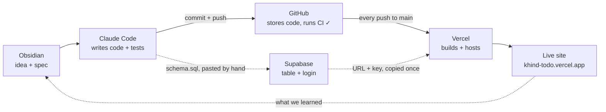
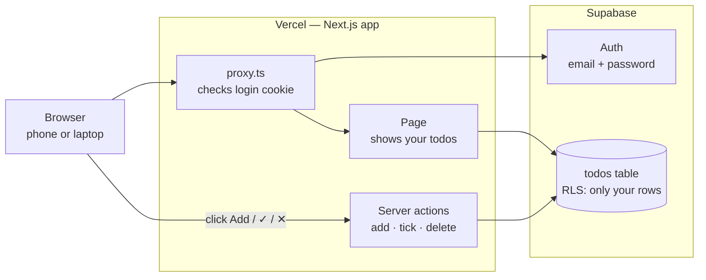

# 04 How it works

Two loops: how **you** build and ship, and what happens when **someone uses** the app. Comes after [[02 Spec]].

## 1. Build and ship (the maker)

Solid arrows happen on **every change**. Dashed arrows are done **by hand** — once at setup, or only when the data changes.

1. **Obsidian** — write the idea and spec as notes ([[01 Idea]], [[02 Spec]]).
2. **Claude Code** — reads the spec, writes the code, runs the tests on your PC.
3. **GitHub** — "commit and push" uploads it; GitHub Actions runs lint, typecheck, tests and build → green ✓ or red ✗.
4. **Vercel** — notices the push, rebuilds, and replaces the live site in about a minute.
5. Write what happened in [[Log]] — then the loop starts again.

### Where's Supabase in this loop?

Supabase is **not** connected to GitHub, so a push never changes the database. It joins the loop by hand:

- **Database changes** — `supabase/schema.sql` is saved in GitHub, but you paste it into Supabase → **SQL Editor** → **Run** yourself. Only needed when a table or security rule changes (e.g. adding a "due date" column). Do it **before** pushing code that uses the new column.
- **Connecting Vercel to Supabase** — the URL + publishable key were copied into Vercel **once** ([[L7 Vercel - go live]]). Every deploy reuses them.

> Most changes (new button, new text, styling) never touch Supabase at all.

## 2. Using the app (every visitor)

1. The **browser** opens `khind-todo.vercel.app`.
2. **proxy.ts** runs first: it checks the login cookie with **Supabase Auth**. No login → sent to `/login`.
3. The **page** asks Supabase for todos. **Row Level Security** means the database only returns *this person's* rows.
4. Clicking Add, tick or ✕ calls a **server action**: it checks who's signed in, saves to the `todos` table, and the page refreshes.

## Where the secrets live

| Thing | Lives in | On GitHub? |
|---|---|---|
| Code + notes | GitHub repo | ✅ yes (public) |
| Supabase URL + publishable key | `.env.local` (your PC) and Vercel settings | ❌ never |
| Supabase secret key | Supabase only — this app never uses it | ❌ never |
| User accounts + todos | Supabase database | ❌ never |
